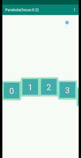
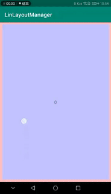

# LinLayoutManager

 

Some LayoutManager created by fanhl.

## LayoutManagers

### 1. CurveLayoutManager

A linear LayoutManger can scroll by any `Curves`.

#### Some default curve.

| type | 类型 | code | sample | params |
|---|---|---|---|---|
| Parabola | 抛物线 | x=i+0.5; y=0.2i^2+0.5 |   | focus |
| Slash | 斜线 | x=i+0.5;y=slope*i+0.5 |  | slope |
|   |   |   |   |   |

#### Custom your curve.

Implements CurveLayoutManger.Curve.

That's it.

## Usage

1. Add it in your root build.gradle at the end of repositories:

        allprojects {
            repositories {
                ...
                maven { url 'https://jitpack.io' }
            }
        }

2. Add the dependency in your module build.gradle:

        dependencies {
                implementation 'com.github.dyguests:LinLayoutManager:x.y.z'
        }

### Step1. Create your curve like this:

    /** 抛物线 */
    class Parabola(
        private val focus: Float = .2f
    ) : CurveLayoutManger.Curve {
        override fun getInterpolation(i: Float, position: CurveLayoutManger.Vector2) {
            position.x = i + 0.5f
            position.y = focus * i * i + 0.5f
        }
    }

### Step1. Set layoutManger like this:

    recycler_view.layoutManager = CurveLayoutManger(Slash())

## Import

TODO

## Resources(资料):

 [创建一个 RecyclerView LayoutManager – Part 1](https://github.com/hehonghui/android-tech-frontier/blob/master/issue-9/%E5%88%9B%E5%BB%BA-RecyclerView-LayoutManager-Part-1.md)

[创建 RecyclerView LayoutManager – Part 2](https://github.com/hehonghui/android-tech-frontier/blob/master/issue-13/%E5%88%9B%E5%BB%BA-RecyclerView-LayoutManager-Part-2.md)

[创建 RecyclerView LayoutManager – Part 3](https://github.com/hehonghui/android-tech-frontier/blob/master/issue-13/%E5%88%9B%E5%BB%BA-RecyclerView-LayoutManager-Part-3.md)

[打造属于你的 LayoutManager](https://www.jianshu.com/p/08d998d047d8)

[Zoom central image recycler view](https://stackoverflow.com/questions/35309710/zoom-central-image-recycler-view/35311728#35311728)

[Recycler view - resizing item view while scrolling (for carousel like effect)](https://stackoverflow.com/questions/41307578/recycler-view-resizing-item-view-while-scrolling-for-carousel-like-effect)

[danylovolokh/LondonEyeLayoutManager](https://github.com/danylovolokh/LondonEyeLayoutManager)

## TODO

- [x] CurveLayoutManager
- [ ] CollageLayoutManager
- [ ] ItemAnimation
- [ ] item间的距离计算公式

## License

    Copyright 2018 Fanhl

    Licensed under the Apache License, Version 2.0 (the "License");
    you may not use this file except in compliance with the License.
    You may obtain a copy of the License at

       http://www.apache.org/licenses/LICENSE-2.0

    Unless required by applicable law or agreed to in writing, software
    distributed under the License is distributed on an "AS IS" BASIS,
    WITHOUT WARRANTIES OR CONDITIONS OF ANY KIND, either express or implied.
    See the License for the specific language governing permissions and
    limitations under the License.