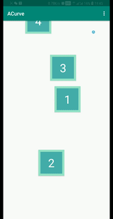
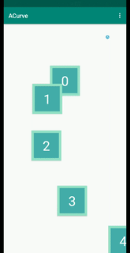
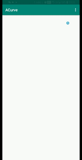

# Custom Tutorial(A Instance)(Hands on)

## Step1. Design your curve.

your can design your curve anyway.

[sources link.](https://www.desmos.com/calculator/ffeu06bgul)

## Step2. Parse to sources.

run App:

## Step3. Parse the Coordinate System.

From right-up coordinate System to right-down coordinate System.

    y = 1 - points.asSequence().mapIndexed { index, vector2 -> b(t, index + 1, vector2.y) }.sum()

## Step4. Set init offset.

The first item should be center of screen, it means t=0.5 not t=0.

    val t = i + .5f

## Step5. Set spacing.

    override fun getItemSpacing(size1: CurveLayoutManger.Vector2, size2: CurveLayoutManger.Vector2): Float {
        return .1f
    }

## Step6. Set start/end offset.

If you don't want position first item at center of screen. but right out of screen, and do the same to last item. your should implements `getStartOffset`,`getEndOffset`.

    override fun getStartOffset(size: CurveLayoutManger.Vector2): Float {
        return .5f
    }

    override fun getEndOffset(size: CurveLayoutManger.Vector2): Float {
        return .5f
    }

## More else?

Will, please see the sources.