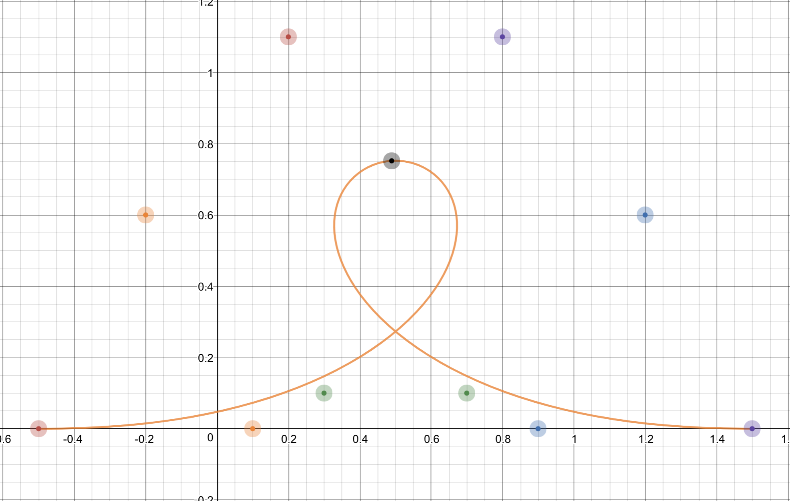
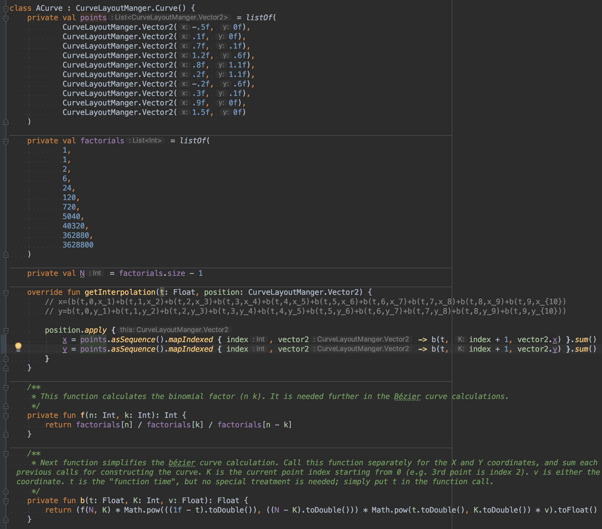

# Custom Tutorial(A Instance)(Hands on)

## Step1. Design your curve.

your can design your curve anyway.

[sources link.](https://www.desmos.com/calculator/ffeu06bgul)

## Step2. Parse to sources.

run App:

## Step3. Parse the Coordinate System.

From right-up coordinate System to right-down coordinate System.

`y = 1f - points.asSequence().mapIndexed { index, vector2 -> b(t, index, vector2.y) }.sum()`

